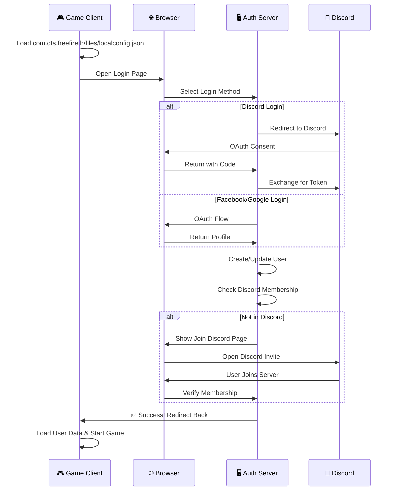
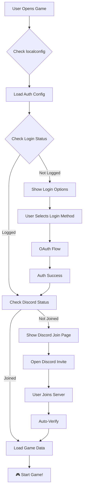
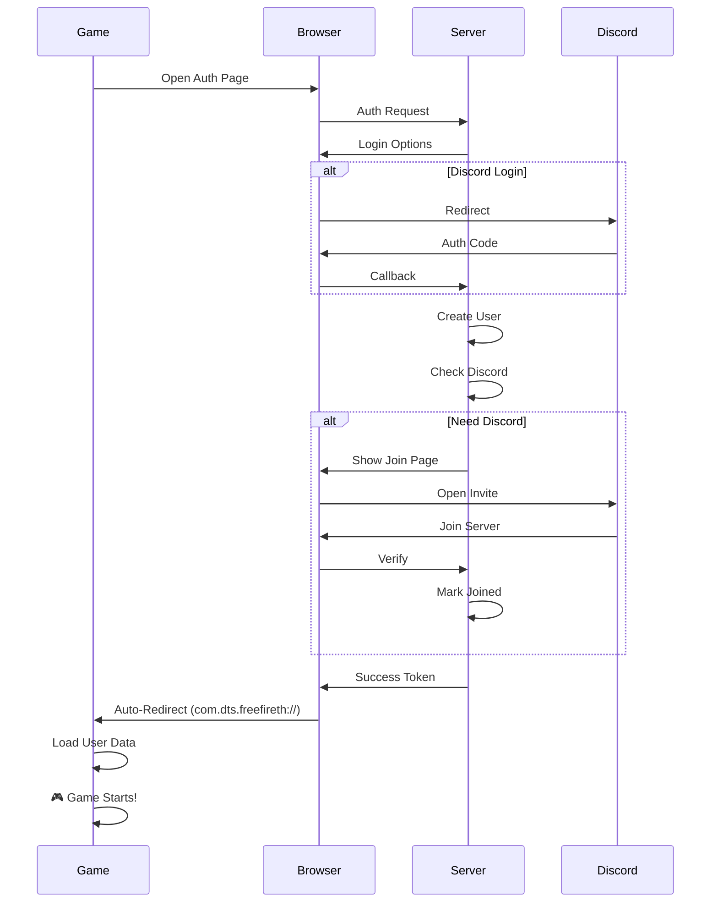

# 🎮 FreeFire Authentication System

<div align="center">
  


[](https://discord.gg/k6R6CKw7Q)

</div>

---

## 🌟 Features

<table>
<tr>
<td>

### 🎯 **Authentication**
- ✅ Discord OAuth2 Login
- ✅ Facebook Login
- ✅ Google Login
- ✅ Normal Email/Password
- ✅ JWT Token System

</td>
<td>

### 🎮 **Game Integration**
- ✅ Local Config File Management
- ✅ Game Data Synchronization
- ✅ Auto-User Detection
- ✅ Game Files Structure
- ✅ Custom Game ID Generation

</td>
</tr>
<tr>
<td>

### 🔐 **Security**
- ✅ Session Management
- ✅ JWT Authentication
- ✅ Password Hashing (bcrypt)
- ✅ Rate Limiting
- ✅ Helmet Security

</td>
<td>

### 👑 **Mod System**
- ✅ Auto-Mod Promotion
- ✅ Permission Management
- ✅ Admin Dashboard
- ✅ User Analytics
- ✅ Activity Tracking

</td>
</tr>
</table>

---

## 📱 Flow Animation



---

## 🚀 Quick Start

<div align="center">

```bash
# 1️⃣ Clone Repository
git clone https://github.com/yourusername/freefire-auth-system.git
cd freefire-auth-system

# 2️⃣ Install Dependencies
npm install

# 3️⃣ Setup Environment
cp .env.example .env
npm run setup

# 4️⃣ Start Server
npm start

# 🎉 Server Running at: http://localhost:3000
```

</div>

---

## 📁 File Structure

```
freefire-auth-system/
├── 🎮 com.dts.freefireth/
│   └── files/
│       ├── localconfig.json      # Game config
│       └── user_*.json           # User data files
├── 📁 config/
│   ├── localconfig.json          # Server config
│   └── game-config.json          # Game settings
├── 📁 auth/
│   ├── discord.js                # Discord strategy
│   ├── facebook.js               # Facebook strategy
│   └── google.js                 # Google strategy
├── 📁 controllers/
│   └── authController.js         # Auth logic
├── 📁 models/
│   └── User.js                   # User schema
├── 📁 routes/
│   └── authRoutes.js             # API routes
├── 📁 middleware/
│   └── auth.js                   # Auth middleware
├── 📁 scripts/
│   ├── setup.js                  # Setup script
│   └── mod-scripts.js           # Mod automation
├── 📁 utils/
│   ├── gameUtils.js              # Game utilities
│   └── configLoader.js           # Config loader
├── 📄 server.js                  # Main server
├── 📄 .env                       # Environment variables
└── 📄 package.json               # Dependencies
```

---

## 🔗 API Endpoints

| Method | Endpoint | Description | Auth |
|--------|----------|-------------|------|
| `GET` | `/auth/discord` | 🔵 Discord Login | Public |
| `GET` | `/auth/facebook` | 🔷 Facebook Login | Public |
| `GET` | `/auth/google` | 🔴 Google Login | Public |
| `POST` | `/auth/login` | 🔐 Email Login | Public |
| `POST` | `/auth/register` | ✨ Register | Public |
| `GET` | `/auth/success` | ✅ Success Page | Required |
| `POST` | `/auth/verify-discord` | ✅ Verify Discord | Required |
| `GET` | `/auth/game-config` | 🎮 Get Config | Required |
| `GET` | `/mod-panel` | 👑 Mod Panel | Mod+ |
| `GET` | `/admin-panel` | ⭐ Admin Panel | Admin |

---

## 🎯 Game Integration Code

### In Your Game (com.dts.freefireth/)

```javascript
// 1. Load local config
const config = loadConfig('com.dts.freefireth/files/localconfig.json');

// 2. Initialize auth
function initAuth() {
    // Open browser for login
    const authUrl = config.serverUrl + '/auth/discord';
    openInBrowser(authUrl);
    
    // Set up deep link listener
    setupDeepLink('com.dts.freefireth://auth/success');
}

// 3. Handle auth callback
function handleAuthCallback(token) {
    // Verify token
    const userData = verifyToken(token);
    
    // Save user data
    saveUserData(userData);
    
    // Load game with user
    startGame(userData);
}

// 4. Check Discord membership
function checkDiscordJoin() {
    if (!userData.joinedDiscord) {
        showDiscordPrompt();
    }
}
```

---

## 🎨 UI Preview

<div align="center">

### Login Page
```
┌─────────────────────────────────────┐
│    🎮 FreeFire Authentication        │
│                                       │
│    ┌─────────────────────────────┐   │
│    │    🔵 Login with Discord     │   │
│    └─────────────────────────────┘   │
│    ┌─────────────────────────────┐   │
│    │    🔷 Login with Facebook    │   │
│    └─────────────────────────────┘   │
│    ┌─────────────────────────────┐   │
│    │    🔴 Login with Google      │   │
│    └─────────────────────────────┘   │
│                                       │
│         ─── or ───                   │
│                                       │
│    ┌─────────────────────────────┐   │
│    │    Email: [__________]      │   │
│    │    Password: [__________]   │   │
│    │       [ Login ]             │   │
│    └─────────────────────────────┘   │
│                                       │
│    Don't have an account? Register   │
└─────────────────────────────────────┘
```

### Discord Join Page
```
┌─────────────────────────────────────┐
│    🎮 Join Our Discord              │
│                                       │
│    ┌─────────────────────────────┐   │
│    │                              │   │
│    │   🎮 Join Discord Server    │   │
│    │                              │   │
│    │   To continue playing,      │   │
│    │   you must join our         │   │
│    │   Discord community!        │   │
│    │                              │   │
│    │    [ 🎮 Join Discord ]      │   │
│    │                              │   │
│    │    [ Return to Game ]       │   │
│    │                              │   │
│    │   Discord: k6R6CKw7Q        │   │
│    └─────────────────────────────┘   │
└─────────────────────────────────────┘
```

</div>

---

## 🛠️ Configuration

### `.env` File
```env
# Server
PORT=3000
NODE_ENV=development
SESSION_SECRET=your_secret_key

# MongoDB
MONGODB_URI=mongodb://localhost:27017/freefire_auth

# Discord
DISCORD_CLIENT_ID=your_client_id
DISCORD_CLIENT_SECRET=your_client_secret
DISCORD_CALLBACK_URL=http://localhost:3000/auth/discord/callback

# Discord Server ID (k6R6CKw7Q)
DISCORD_GUILD_ID=k6R6CKw7Q

# Facebook
FACEBOOK_APP_ID=your_app_id
FACEBOOK_APP_SECRET=your_app_secret
FACEBOOK_CALLBACK_URL=http://localhost:3000/auth/facebook/callback

# Google
GOOGLE_CLIENT_ID=your_client_id
GOOGLE_CLIENT_SECRET=your_client_secret
GOOGLE_CALLBACK_URL=http://localhost:3000/auth/google/callback

# JWT
JWT_SECRET=your_jwt_secret
JWT_EXPIRATION=30d
```

### `localconfig.json` (Game Config)
```json
{
  "game": {
    "name": "FreeFire",
    "version": "1.0.0",
    "serverUrl": "http://localhost:3000",
    "redirectUri": "com.dts.freefireth:/auth/callback"
  },
  "auth": {
    "requireDiscordJoin": true,
    "discordServerId": "k6R6CKw7Q",
    "autoRedirect": true,
    "redirectDelay": 2000
  }
}
```

---

## 🎯 Features in Action

### ✨ Auto-Detection Flow



### 🔄 Auto-Redirect Flow



---

## 📊 Database Schema

```javascript
User {
  username: String,
  email: String,
  authType: 'discord'|'facebook'|'google'|'normal',
  discordId: String,
  discordUsername: String,
  joinedDiscord: Boolean,
  gameId: String,
  gameLevel: Number,
  gameWins: Number,
  gameStats: {
    kills: Number,
    deaths: Number,
    matchesPlayed: Number
  },
  role: 'user'|'mod'|'admin'|'vip',
  permissions: [String],
  lastLogin: Date,
  loginCount: Number
}
```

---

## 🎮 Game Integration Scripts

### Game Side Implementation

```javascript
// auth.js - Game Auth Module

class GameAuth {
    constructor() {
        this.config = null;
        this.userData = null;
        this.token = null;
    }

    // Load config from game files
    async loadConfig() {
        const configPath = 'com.dts.freefireth/files/localconfig.json';
        this.config = await readFile(configPath);
        return this.config;
    }

    // Initiate login
    async login(method = 'discord') {
        const authUrl = `${this.config.serverUrl}/auth/${method}`;
        openBrowser(authUrl);
        
        // Setup deep link listener
        this.setupDeepLink();
    }

    // Handle deep link callback
    setupDeepLink() {
        // Listen for com.dts.freefireth://auth/success
        Deeplink.on('success', async (data) => {
            this.token = data.token;
            await this.loadUserData();
            this.startGame();
        });
    }

    // Load user data from server
    async loadUserData() {
        const response = await fetch(`${this.config.serverUrl}/auth/game-config`, {
            headers: { 'Authorization': `Bearer ${this.token}` }
        });
        this.userData = await response.json();
        
        // Save to game files
        await saveUserData(this.userData);
    }

    // Check if user joined Discord
    checkDiscordStatus() {
        if (!this.userData.joinedDiscord && this.config.auth.requireDiscordJoin) {
            this.showDiscordPrompt();
            return false;
        }
        return true;
    }

    // Show Discord join prompt
    showDiscordPrompt() {
        const discordLink = 'https://discord.gg/k6R6CKw7Q';
        showModal({
            title: 'Join Discord',
            message: 'Please join our Discord server to continue!',
            button: 'Join Discord',
            onPress: () => openBrowser(discordLink)
        });
    }

    // Start game
    startGame() {
        if (this.checkDiscordStatus()) {
            // Load game with user data
            Game.load(this.userData);
        }
    }
}

// Usage
const auth = new GameAuth();
await auth.loadConfig();
await auth.login('discord');
```

---

## 🚀 Deployment

### Docker Setup
```dockerfile
FROM node:18-alpine

WORKDIR /app

COPY package*.json ./
RUN npm install

COPY . .

EXPOSE 3000

CMD ["npm", "start"]
```

### Docker Commands
```bash
# Build image
docker build -t freefire-auth .

# Run container
docker run -p 3000:3000 -d freefire-auth

# With environment variables
docker run -p 3000:3000 --env-file .env -d freefire-auth
```

---

## 🔥 Troubleshooting

### Common Issues

<details>
<summary>❌ Discord OAuth Error</summary>

**Solution:**
1. Check `DISCORD_CLIENT_ID` and `DISCORD_CLIENT_SECRET`
2. Verify callback URL matches Discord Developer Console
3. Ensure redirect URI is: `http://localhost:3000/auth/discord/callback`
</details>

<details>
<summary>❌ Game Files Not Found</summary>

**Solution:**
1. Run `npm run setup` to create game directories
2. Check permissions on `com.dts.freefireth/` folder
3. Verify path in `localconfig.json`
</details>

<details>
<summary>❌ Discord Join Verification Fails</summary>

**Solution:**
1. User must actually join the Discord server
2. Check `DISCORD_GUILD_ID` is correct (`k6R6CKw7Q`)
3. Verify bot has `guild_members` intent enabled
</details>

---

## 📱 Quick Commands

```bash
# 🚀 Start Server
npm start

# 🛠️ Development Mode
npm run dev

# 📦 Setup Game Files
npm run setup

# 🧹 Clear Cache
npm run clean

# 📊 View Logs
tail -f logs/app.log

# 🔄 Restart Server
pm2 restart freefire-auth
```

---

## 🌐 Links

<div align="center">

[](https://discord.gg/k6R6CKw7Q)
[](https://github.com/yourusername/freefire-auth-system)
[](http://localhost:3000)

</div>

---

## 📝 License

<div align="center">

MIT © [Your Name]

**Made with ❤️ for the FreeFire Community**

</div>

---

## ⭐ Support

If you find this useful, please give it a ⭐ on GitHub!

<div align="center">
  
[](https://github.com/yourusername/freefire-auth-system)
[](https://github.com/yourusername)

</div>
